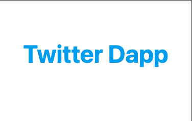
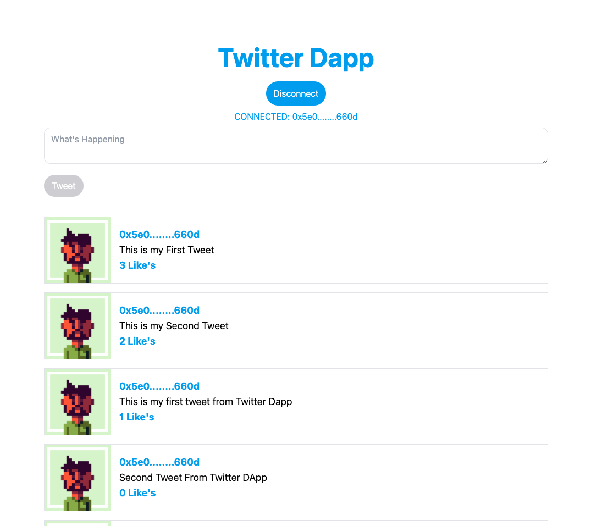
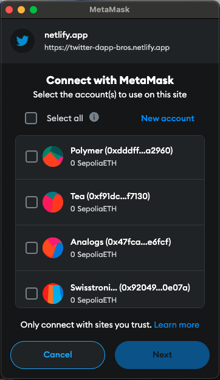
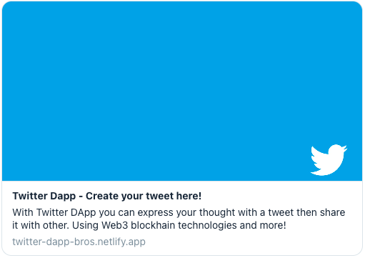

# Twitter DApp

    

<b>Twitter DApp!</b> is a mini blog app where you can express your thought with a tweet then share it with the other's.

## Technologies

     <image align="center" width="80" src='./src/assets/logo.svg' />
     <image align="center" width="80" src='./src/assets/Vitejs-logo.svg' style="margin: 0 10px" />
     <image align="center" width="80" src='./src/assets/web3js-seeklogo.svg' style="margin: 0 10px" />
     <image align="center" width="90" src='./src/assets/MetaMask_Fox.svg' />

  This is a <b>Web3 Blockchain</b> application using the <b>Ethereum Sepolia</b> Testnet network.   
  Built with <b>Vue 3</b> and integrated with <b>Blockchain</b> using <b>Web3js</b>.

## Table of Contents

- [Introduction](#introduction)
- [Features](#features)
- [Requirements](#requirements)
- [Screenshots](#screenshots)
- [Contributors](#contributors)

## Features

- User can Connect Metamask to Login
- User can see their wallet when Connected
- User can Write Tweet
- User can Like Tweet

## Requirements

- [`yarn`](https://yarnpkg.com)
- [`vue`](https://vuejs.org)
- [`vite`](https://vitejs.dev)
- [`web3`](https://web3js.readthedocs.io)

## Screenshots

    
    
    

## Live Demo

<a href="https://twitter-dapp-bros.netlify.app/">
  twitter-dapp-bros.netlify.app
</a>

## Contributors

  <table>
    <tr>
      <td align="center">
        <a href="https://github.com/melankolia">
          
          <b>Ageng Setyo Nugroho</b>
        </a>
      </td>
    </tr>
  </table>
